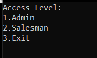
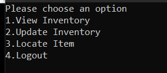
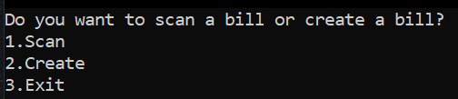

# Simple-Sales-Checkout-System
This code is a simple Sales Checkout System that will ask the user to input the current date and login credentials that is stored in a .txt file and allows them to manipulate the inventory for checkout and allows the user to print out the receipt at the final phase of the checkout process.

# Required Txt Files:
1. Admin.txt (Txt file to store admin login credentials) 
2. Staff.txt (Txt file to store all staff login credentials) 
3. Inventory.txt (Txt file to store all the product inventory data) 
4. NoInventory.txt (Txt file to record all the deduction of inventory after checkout) 
5. BillEntry.txt (Txt file to count and create unique receipt code number) 

# Explanation of Code
# Part 1: Validation of Date 

The code will prompt user to enter a valid date which the input will be used to be displayed in the receipt generated at the checkout

# Part 2: Selecting Login Options

Users will be prompted to select the level of access which each has their own functionality where once they have entered the password, the code will check either Admin.txt or Staff.txt to validate the credentials.

# Part 3 A: Functions for Admin

Admins of the system can view, update and locate items in the store where each action will be highly dependant on the Inventory.txt to manipulate and display the data. 

# Part 3 B: Functions for Salesman

Staff on the other hand can scan a bill to display the previous transaction or create a new bill which will be using Inventory.txt as well with an addition of replying on NoInventory to cross-check the remaining inventory after every transaction.
